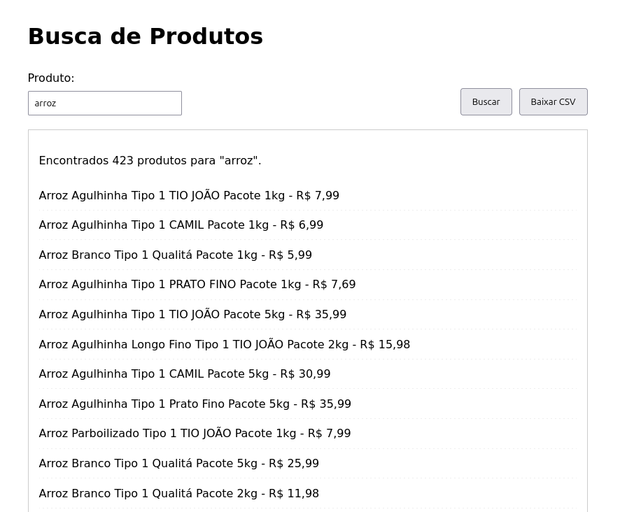

# Busca de Produtos GPA com Interface Web Flask 🛒

### Visão Geral

Este projeto fornece uma interface web simples, construída com Flask e JavaScript, para buscar produtos na API interna (não oficial) utilizada pelo site do Pão de Açúcar (GPA Digital). Ele permite que um usuário digite um termo de busca, veja os resultados (nome e preço) carregados dinamicamente na página e baixe esses resultados como um arquivo CSV.

**Disclaimer:** Este projeto interage com uma API (`api.vendas.gpa.digital`) que **não é pública nem oficialmente documentada** pelo GPA. APIs internas podem mudar ou ser desativadas a qualquer momento sem aviso prévio, o que **quebrará** este projeto. Use por sua conta e risco, de forma ética e responsável. **Evite fazer um número excessivo de requisições** para não sobrecarregar os servidores do GPA ou ter seu IP bloqueado. Verifique os Termos de Serviço do site de origem.

## ✨ Funcionalidades

*   **Interface Web:** Frontend amigável usando HTML, CSS e JavaScript.
*   **Busca Dinâmica:** Campo de busca que aciona a consulta à API do GPA através do backend Flask.
*   **Resultados na Página:** Exibe o nome e o preço dos produtos encontrados diretamente na página.
*   **Feedback Visual:** Mostra mensagens de "Aguarde, buscando..." e de erro.
*   **Download CSV (Client-Side):** Permite baixar um arquivo CSV contendo nome e preço dos produtos *sem* fazer uma nova requisição ao backend, usando os dados já carregados no navegador.
*   **Scraping de API com Paginação:** O backend (`scraper.py`) lida automaticamente com a busca em múltiplas páginas da API de origem para obter a lista completa de produtos.
*   **Código Organizado:** Separação clara entre backend (Python/Flask), frontend (HTML/CSS/JS) e lógica de scraping.

## 💻 Tecnologias Utilizadas

*   **Backend:** Python 3, Flask, Requests
*   **Frontend:** HTML5, CSS3, JavaScript (Vanilla)
*   **Fonte de Dados:** API interna (não oficial) `api.vendas.gpa.digital`

## 📁 Estrutura do Projeto

```
.
├── image.png        # Imagem utilizada no README (opcional)
├── README.md        # Este arquivo de descrição
└── src/             # Diretório principal contendo o código da aplicação
    ├── app.py       # Aplicação principal Flask (servidor web e endpoint da API)
    ├── scraper.py   # Módulo com a lógica de scraping da API do GPA
    ├── static/      # Pasta para arquivos estáticos (CSS, JS)
    │   ├── script.js  # Lógica JavaScript do frontend
    │   └── style.css  # Estilos CSS
    └── templates/    # Pasta para templates HTML (Jinja2)
        └── index.html  # Template HTML principal da interface

```

## ⚙️ Pré-requisitos

*   Python 3.7+
*   pip (gerenciador de pacotes Python)

## 🚀 Instalação e Configuração

1.  **Clone ou Baixe o Repositório:**
    ```bash
    git clone https://github.com/esscova/scraper-pda.git
    cd scraper-pda
    ```
    (Ou apenas baixe os arquivos e coloque-os na estrutura de pastas descrita acima).

2.  **Crie e Ative um Ambiente Virtual (Recomendado):**
    ```bash
    python -m venv venv
    # No Windows:
    .\venv\Scripts\activate
    # No macOS/Linux:
    source venv/bin/activate
    ```

3.  **Instale as Dependências Python:**
    ```bash
    pip install -r requirements.txt
    ```

## ▶️ Como Usar

1.  **Inicie o Servidor Flask:**
    No terminal, dentro do diretório do projeto (e com o ambiente virtual ativado), execute:
    ```bash
    python app.py
    ```
    O servidor será iniciado, geralmente em `http://127.0.0.1:5000/` ou `http://0.0.0.0:5000/`.
    **Atenção:** Por padrão, ele roda em modo de depuração (`debug=True`), que é útil para desenvolvimento, mas **NÃO DEVE** ser usado em produção.

2.  **Acesse a Interface no Navegador:**
    Abra seu navegador e visite o endereço onde o servidor está rodando, por exemplo: `http://127.0.0.1:5000/`

3.  **Faça uma Busca:**
    *   Digite o nome do produto desejado no campo "Produto" (ex: "leite", "café especial").
    *   Clique no botão "Buscar" (ou pressione Enter).

4.  **Aguarde os Resultados:**
    *   Você verá a mensagem "Aguarde, buscando dados...". O JavaScript está chamando o backend Flask (`/api/search`), que por sua vez está chamando o `scraper.py` para buscar os dados na API do GPA (isso pode levar alguns segundos ou mais, dependendo da quantidade de produtos/páginas).

5.  **Veja os Resultados:**
    *   A lista de produtos (nome e preço) será exibida na página.
    *   Uma mensagem de resumo informará quantos produtos foram encontrados.
    *   O botão "Baixar CSV" ficará ativo.

6.  **Baixe o CSV (Opcional):**
    *   Clique no botão "Baixar CSV".
    *   O JavaScript no seu navegador gerará o arquivo CSV *imediatamente* a partir dos dados já exibidos e iniciará o download. Nenhuma nova busca no backend é realizada para esta ação.

## ⚠️ Considerações Importantes

*   **API Não Oficial:** Reforçando: A API do GPA pode mudar ou parar de funcionar a qualquer momento.
*   **Ética e Termos de Serviço:** Use com moderação e respeite as regras do site Pão de Açúcar.
*   **Rate Limiting/Bloqueio:** Requisições excessivas podem bloquear seu IP. O `scraper.py` inclui um pequeno atraso, mas seja cauteloso.
*   **Desempenho:** Buscas por termos muito genéricos (muitos produtos/páginas) levarão mais tempo para serem processadas pelo backend.
*   **Estrutura dos Dados:** A aplicação depende da estrutura atual dos dados retornados pela API do GPA. Se essa estrutura mudar, a exibição e o download podem falhar.

## Contatos
**LinkedIn**: [in/wellington-moreira-santos](https://www.linkedin.com/in/wellington-moreira-santos/)